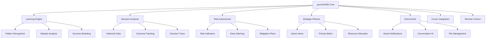

# gunnchAI3k 🤖✨

**Smart Gunncho Enabled Bot** - Your AI-Powered Executive Assistant

[](LICENSE)


> **Empowering Founders & CEOs to Keep Founding and Executing** 🚀

gunnchAI3k is an intelligent AI assistant that learns from your decisions, adapts to your mistakes, and provides strategic insights to help you focus on what matters most - building and scaling your vision.

---

## 🧠 **Core Intelligence**

### **Learning & Adaptation**
- **📚 Decision Learning**: Analyzes your past decisions and outcomes
- **🔄 Mistake Analysis**: Learns from failures to suggest better approaches
- **📈 Pattern Recognition**: Identifies successful strategies and warns of potential pitfalls
- **🎯 Strategic Recommendations**: Provides data-driven action plans

### **Executive Features**
- **📋 Action Items**: Tracks and prioritizes tasks automatically
- **💬 Smart Conversations**: Context-aware discussions about your projects
- **📊 Progress Updates**: Real-time insights into your initiatives
- **🔔 Intelligent Notifications**: Only alerts you when it matters

---

## 🎯 **Key Capabilities**

### **🤖 AI-Powered Intelligence**
- **Learning Engine**: Continuously improves from your feedback
- **Decision Support**: Suggests optimal paths based on historical data
- **Risk Assessment**: Identifies potential issues before they become problems
- **Strategic Planning**: Helps prioritize initiatives and resources

### **📱 Multi-Platform Control**
- **Discord Integration**: Full bot functionality with smart notifications
- **Cursor Control**: Direct integration with your development environment
- **Remote Management**: Control from anywhere with secure access
- **Mute Capabilities**: Focus mode when you need to concentrate

### **📊 Project Management**
- **GitHub Integration**: Tracks repositories, issues, and pull requests
- **Assignment Tracking**: Monitors team tasks and deadlines
- **Communication Hub**: Centralizes announcements and updates
- **File Management**: Organizes documents and resources

---

## 🚀 **Quick Start**

### **Prerequisites**
- Node.js 18+ 
- Discord Server
- GitHub Repository Access

### **Installation**

```bash
# Clone the repository
git clone https://github.com/gunnchOS3k/gunnchAI3k.git
cd gunnchAI3k

# Install dependencies
npm install

# Configure environment
cp .env.example .env
# Edit .env with your credentials

# Start the bot
npm run dev
```

### **Configuration**

1. **Discord Setup**:
   - Create Discord Application
   - Get Bot Token, Client ID, Guild ID
   - Invite bot to your server

2. **GitHub Integration**:
   - Generate Personal Access Token
   - Configure repository access

3. **AI Learning**:
   - Enable learning mode
   - Configure decision tracking
   - Set up feedback loops

---

## 🎮 **Commands & Features**

### **Core Commands**
- `/learn` - Teach the AI from your decisions
- `/analyze` - Get strategic analysis of your projects
- `/suggest` - Receive AI-powered recommendations
- `/track` - Monitor progress and metrics
- `/focus` - Enable/disable notifications

### **Project Management**
- `/assign` - Create and assign tasks
- `/update` - Report progress and updates
- `/meeting` - Schedule and manage meetings
- `/announce` - Share important information

### **Intelligence Features**
- `/pattern` - Analyze patterns in your work
- `/risk` - Assess potential risks
- `/optimize` - Get efficiency suggestions
- `/predict` - Forecast outcomes

---

## 🏗️ **Architecture**



---

## 📁 **Project Structure**

```
gunnchAI3k/
├── src/
│   ├── core/           # AI learning engine
│   ├── discord/        # Discord bot integration
│   ├── cursor/         # Cursor IDE integration
│   ├── github/         # GitHub API integration
│   ├── learning/       # Machine learning modules
│   └── utils/          # Utility functions
├── data/
│   ├── decisions/      # Decision history
│   ├── patterns/       # Learned patterns
│   └── models/         # AI models
├── docs/              # Documentation
├── tests/             # Test suites
└── config/            # Configuration files
```

---

## 🧪 **Learning & Adaptation**

### **Decision Learning**
- Tracks your choices and their outcomes
- Identifies successful decision patterns
- Learns from mistakes and failures
- Suggests improvements for future decisions

### **Pattern Recognition**
- Analyzes your work habits and preferences
- Identifies optimal times for different tasks
- Recognizes successful project patterns
- Warns about potential problem patterns

### **Strategic Intelligence**
- Provides data-driven recommendations
- Suggests resource allocation strategies
- Identifies opportunities and threats
- Helps prioritize initiatives

---

## 🔧 **Development**

### **Local Development**
```bash
npm run dev          # Start development server
npm run test         # Run test suite
npm run build        # Build for production
npm run deploy       # Deploy to production
```

### **AI Training**
```bash
npm run train        # Train AI models
npm run analyze      # Analyze learning data
npm run optimize     # Optimize performance
```

### **Integration Testing**
```bash
npm run test:discord # Test Discord integration
npm run test:cursor  # Test Cursor integration
npm run test:github  # Test GitHub integration
```

---

## 📊 **Analytics & Insights**

### **Performance Metrics**
- Decision accuracy over time
- Learning curve progression
- Success rate improvements
- Risk mitigation effectiveness

### **Strategic Reports**
- Weekly performance summaries
- Monthly strategic insights
- Quarterly learning reports
- Annual optimization recommendations

---

## 🛡️ **Security & Privacy**

- **Data Encryption**: All learning data is encrypted
- **Privacy First**: No data leaves your control
- **Secure Access**: Multi-factor authentication
- **Audit Logs**: Complete activity tracking

---

## 🤝 **Contributing**

1. Fork the repository
2. Create a feature branch
3. Make your changes
4. Add tests for new functionality
5. Submit a pull request

---

## 📄 **License**

MIT License - see [LICENSE](LICENSE) file for details.

---

## 🆘 **Support**

- **Documentation**: [docs/](docs/)
- **Issues**: [GitHub Issues](https://github.com/gunnchOS3k/gunnchAI3k/issues)
- **Discussions**: [GitHub Discussions](https://github.com/gunnchOS3k/gunnchAI3k/discussions)

---

**Built with ❤️ by gunnchOS3k**

*Empowering founders to focus on what matters most - building the future.*
