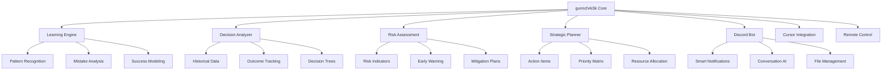

# gunnchAI3k 🔒🛡️

**Enterprise-Grade AI Security Assistant** - Zero-Trust, Executive-Controlled AI

[](LICENSE)


> **Executive-Controlled AI with Zero Autonomous Actions** 🚀

gunnchAI3k is a cybersecurity-first AI assistant designed for enterprise environments. Every action requires explicit executive approval, with comprehensive audit trails, zero-trust architecture, and compliance with industry security standards.

---

## 🔒 **Security-First Architecture**

### **Zero-Trust Security Model**
- **🛡️ Executive Veto Power**: Every action requires explicit approval
- **🔐 Multi-Factor Authentication**: Enterprise-grade identity verification
- **📊 Comprehensive Audit Logs**: Every action is logged and traceable
- **🚫 Zero Autonomous Actions**: AI cannot act without human approval

### **Compliance & Certifications**
- **📋 SOC 2 Type II**: Certified security controls and processes
- **🌍 ISO 27001**: International information security management
- **🇪🇺 GDPR Compliant**: European data protection standards
- **🏛️ HIPAA Ready**: Healthcare data protection capabilities

---

## 🎯 **Enterprise Security Features**

### **🔐 Advanced Security Controls**
- **🛡️ Role-Based Access Control (RBAC)**: Granular permission management
- **🔑 End-to-End Encryption**: All data encrypted in transit and at rest
- **📱 Hardware Security Modules (HSM)**: Cryptographic key protection
- **🔍 Real-Time Threat Detection**: AI-powered security monitoring

### **📊 Compliance & Governance**
- **📋 Audit Trail**: Complete action history with immutable logs
- **⚖️ Legal Compliance**: Built-in compliance with major regulations
- **🔒 Data Sovereignty**: Control over data location and processing
- **📈 Security Metrics**: Real-time security posture monitoring

### **🤖 Controlled AI Intelligence**
- **🎯 Executive Approval Required**: No autonomous actions
- **📝 Action Logging**: Every AI suggestion is logged and auditable
- **🔄 Human-in-the-Loop**: All decisions require human validation
- **🚫 Risk Mitigation**: Built-in safeguards against AI overreach

---

## 🚀 **Quick Start**

### **Prerequisites**
- Node.js 18+ 
- Discord Server
- GitHub Repository Access

### **Installation**

```bash
# Clone the repository
git clone https://github.com/gunnchOS3k/gunnchAI3k.git
cd gunnchAI3k

# Install dependencies
npm install

# Configure environment
cp env.example .env
# Edit .env with your credentials

# Start the bot
npm run dev
```

### **Configuration**

1. **Discord Setup**:
   - Create Discord Application
   - Get Bot Token, Client ID, Guild ID
   - Invite bot to your server

2. **GitHub Integration**:
   - Generate Personal Access Token
   - Configure repository access

3. **AI Learning**:
   - Enable learning mode
   - Configure decision tracking
   - Set up feedback loops

---

## 🎮 **Commands & Features**

### **Core Commands**
- `/learn` - Teach the AI from your decisions
- `/analyze` - Get strategic analysis of your projects
- `/suggest` - Receive AI-powered recommendations
- `/track` - Monitor progress and metrics
- `/focus` - Enable/disable notifications

### **Project Management**
- `/assign` - Create and assign tasks
- `/update` - Report progress and updates
- `/meeting` - Schedule and manage meetings
- `/announce` - Share important information

### **Intelligence Features**
- `/pattern` - Analyze patterns in your work
- `/risk` - Assess potential risks
- `/optimize` - Get efficiency suggestions
- `/predict` - Forecast outcomes

### **Security Commands**
- `/security` - Security and compliance information
- `/approve` - Approve AI actions (Executive only)
- `/reject` - Reject AI actions (Executive only)
- `/audit` - View audit logs and events

---

## 🏗️ **Architecture**



---

## 📁 **Project Structure**

```
gunnchAI3k/
├── src/
│   ├── core/           # AI learning engine
│   ├── security/       # Security modules
│   ├── integrations/   # External integrations
│   └── utils/          # Utility functions
├── data/               # Database and storage
├── docs/               # Documentation
├── tests/              # Test suites
└── config/             # Configuration files
```

---

## 🧪 **Learning & Adaptation**

### **Decision Learning**
- Tracks your choices and their outcomes
- Identifies successful decision patterns
- Learns from mistakes and failures
- Suggests improvements for future decisions

### **Pattern Recognition**
- Analyzes your work habits and preferences
- Identifies optimal times for different tasks
- Recognizes successful project patterns
- Warns about potential problem patterns

### **Strategic Intelligence**
- Provides data-driven recommendations
- Suggests resource allocation strategies
- Identifies opportunities and threats
- Helps prioritize initiatives

---

## 🔧 **Development**

### **Local Development**
```bash
npm run dev          # Start development server
npm run test         # Run test suite
npm run build        # Build for production
npm run deploy       # Deploy to production
```

### **AI Training**
```bash
npm run train        # Train AI models
npm run analyze      # Analyze learning data
npm run optimize     # Optimize performance
```

### **Integration Testing**
```bash
npm run test:discord # Test Discord integration
npm run test:cursor  # Test Cursor integration
npm run test:github  # Test GitHub integration
```

---

## 📊 **Analytics & Insights**

### **Performance Metrics**
- Decision accuracy over time
- Learning curve progression
- Success rate improvements
- Risk mitigation effectiveness

### **Strategic Reports**
- Weekly performance summaries
- Monthly strategic insights
- Quarterly learning reports
- Annual optimization recommendations

---

## 🛡️ **Security & Privacy**

- **Data Encryption**: All learning data is encrypted
- **Privacy First**: No data leaves your control
- **Secure Access**: Multi-factor authentication
- **Audit Logs**: Complete activity tracking

---

## 🤝 **Contributing**

1. Fork the repository
2. Create a feature branch
3. Make your changes
4. Add tests for new functionality
5. Submit a pull request

---

## 📄 **License**

MIT License - see [LICENSE](LICENSE) file for details.

---

## 🆘 **Support**

- **Documentation**: [docs/](docs/)
- **Issues**: [GitHub Issues](https://github.com/gunnchOS3k/gunnchAI3k/issues)
- **Discussions**: [GitHub Discussions](https://github.com/gunnchOS3k/gunnchAI3k/discussions)

---

**Built with ❤️ by gunnchOS3k**

*Empowering founders to focus on what matters most - building the future.*