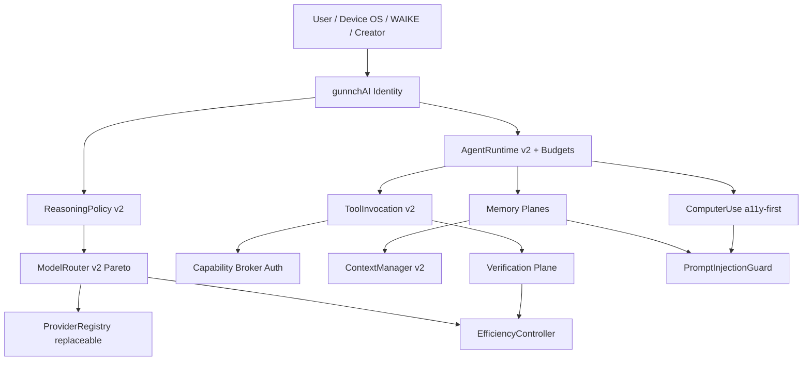

# Kirby v2 Architecture

```mermaid
flowchart TB
  User[User / Device OS / WAIKE / Creator]
  Identity[gunnchAI Identity]
  Policy[ReasoningPolicy v2]
  Router[ModelRouter v2 Pareto]
  Providers[ProviderRegistry replaceable]
  Broker[Capability Broker Auth]
  Tools[ToolInvocation v2]
  Agents[AgentRuntime v2 + Budgets]
  CU[ComputerUse a11y-first]
  Mem[Memory Planes]
  Ctx[ContextManager v2]
  Ver[Verification Plane]
  Guard[PromptInjectionGuard]
  Eff[EfficiencyController]

  User --> Identity --> Policy --> Router --> Providers
  Identity --> Agents --> Tools --> Broker
  Agents --> CU
  Agents --> Mem --> Ctx
  Tools --> Ver
  Mem --> Guard
  CU --> Guard
  Router --> Eff
  Ver --> Eff
```

Additive research foundation. No silent production default changes.
