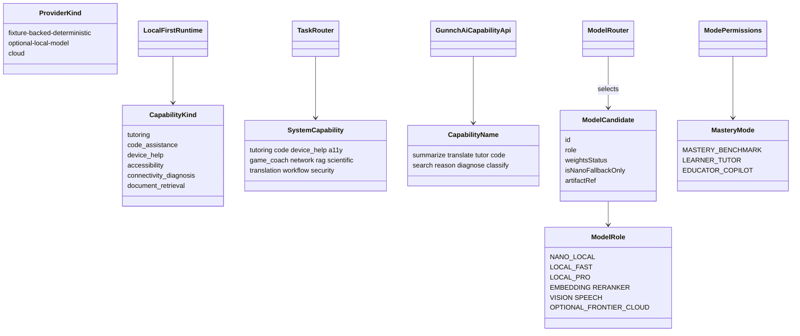

# Class — capability and model (current)

Types that exist in TypeScript. Weights are registry metadata, not committed binaries.

Sources: `src/local-runtime/types.ts`, `src/system-layer/model_registry.ts`, `src/stage2/fleet/roles.ts`, `src/stage2/os/capability_api.ts`, `src/waike-mastery/modes.ts`.
