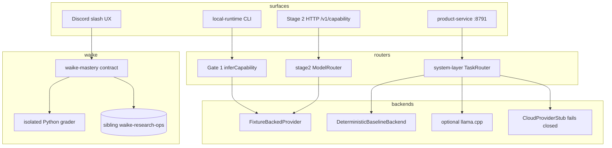

# Component — current

Three routing stacks plus WAIKE mastery. Discord tutor UX is a separate surface.

There is no production cloud inference in this checkout. Stage 2 invoke currently **echoes** the selected model id (`src/stage2/os/capability_api.ts`).
