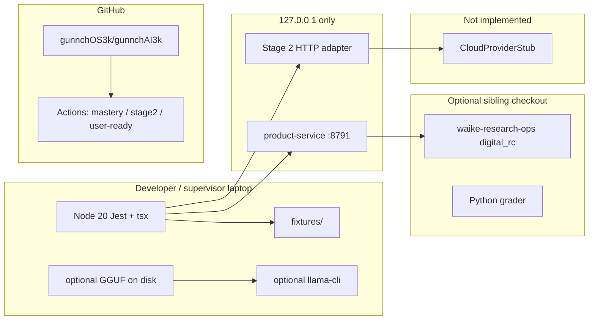

# Deployment — current (local / edge / cloud)

No production web host is claimed. QEMU host-forward topology is documented in `docs/system-layer/QEMU_HOST_FORWARD_TOPOLOGY.md` as **digital**, not physical EVT.
