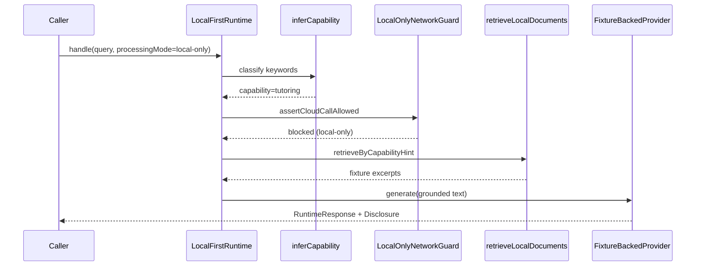

# Sequence — model routing (current)

Happy path for a local tutoring request. Cloud is omitted unless `cloudConsent` and `cloud-allowed` are both set; even then the cloud provider **throws** `CLOUD_NOT_IMPLEMENTED`.

Stage 2 variant: caller → `GunnchAiCapabilityApi.invoke` → `ModelRouter.route` → echo `[tutor] via ${selectedModelId}` (`src/stage2/os/capability_api.ts`, `src/stage2/fleet/router.ts`).
