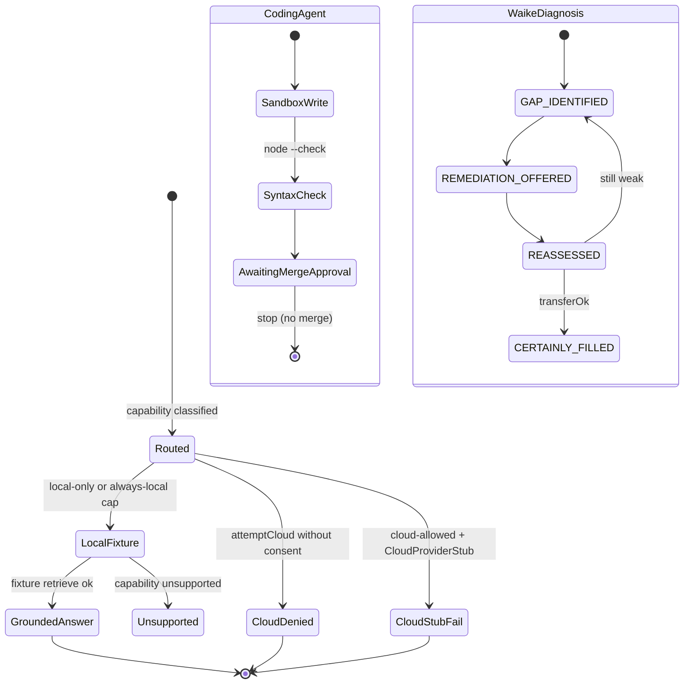

# State machine — agent / task (current)

Coding-agent and WAIKE diagnosis states that exist in code. Not a learned planner.

Sources: `src/local-runtime/runtime.ts`, `src/phase_xiv/computer_use/coding_agent.ts`, `src/user-ready/coding_agent_pr.ts`, `src/waike-mastery/diagnosis.ts`.
