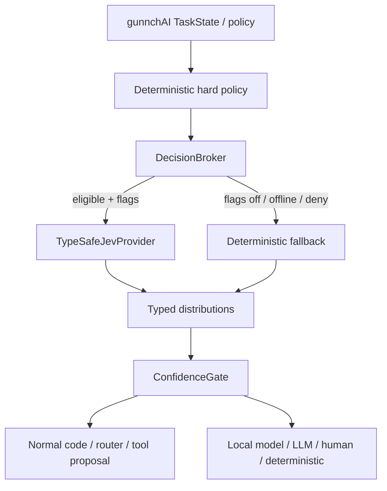

# System One decision plane

```mermaid
flowchart TD
  user[gunnchAI TaskState / policy] --> hard[Deterministic hard policy]
  hard --> broker[DecisionBroker]
  broker -->|flags off / offline / deny| local[Deterministic fallback]
  broker -->|eligible + flags| remote[TypeSafeJevProvider]
  remote --> answers[Typed distributions]
  local --> answers
  answers --> gate[ConfidenceGate]
  gate --> safe[Normal code / router / tool proposal]
  gate --> uncertain[Local model / LLM / human / deterministic]
```

Source: `src/decision_plane/`, `src/providers/typesafe/`.
