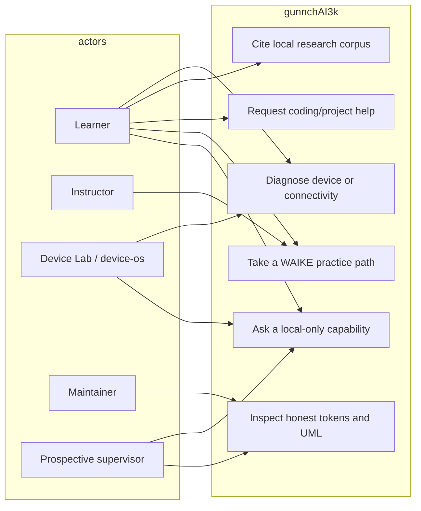

# Use case — current

Actors: learner, instructor, device-os caller, maintainer, prospective supervisor. gunnchAI3k does not execute RAN control and does not claim frontier chat quality.

Code: `src/local-runtime/runtime.ts`, `src/waike-mastery/modes.ts`, `src/stage2/os/capability_api.ts`, `src/system-layer/os_integration/product_surfaces.ts`.
