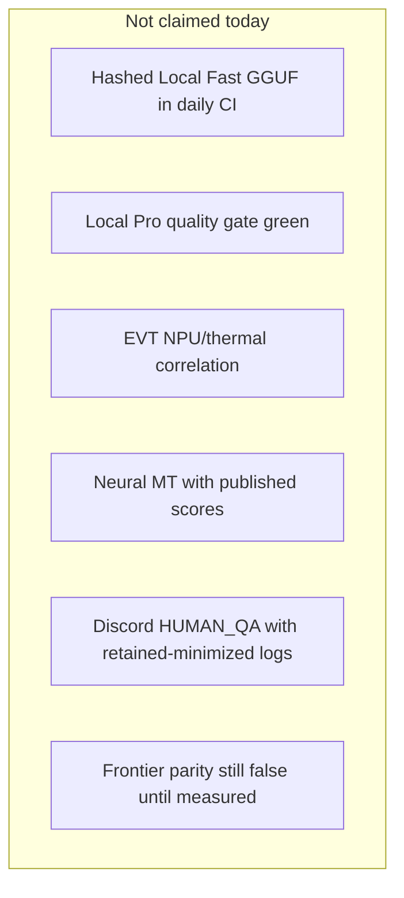

# Future — hosted runtime (not current)

```mermaid
flowchart TB
  subgraph future [Not claimed today]
    FAST[Hashed Local Fast GGUF in daily CI]
    PRO[Local Pro quality gate green]
    NPU[EVT NPU/thermal correlation]
    MT[Neural MT with published scores]
    LIVE[Discord HUMAN_QA with retained-minimized logs]
    FRONTIER[Frontier parity still false until measured]
  end
```

Until those packets close, `GUNNCHAI_FRONTIER_PRODUCT_PARITY=false`, `benchmarks/NEXT_PACKET_OPEN.md` remains the gap list, and cloud stays a failing stub.
